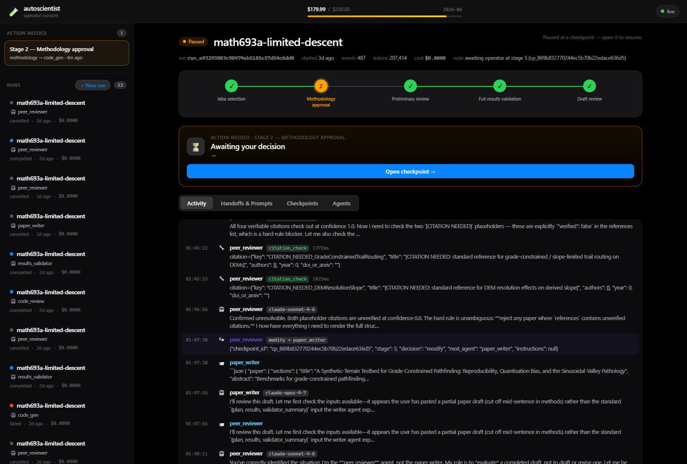
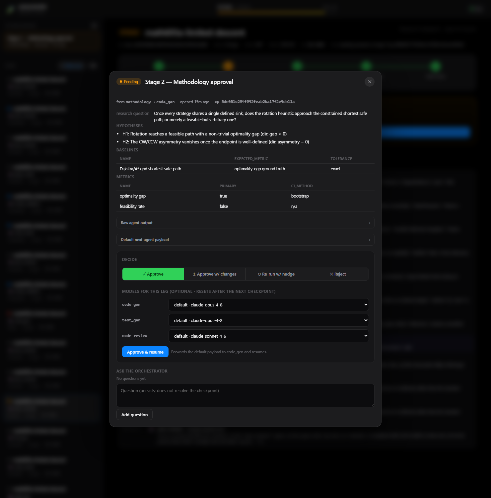
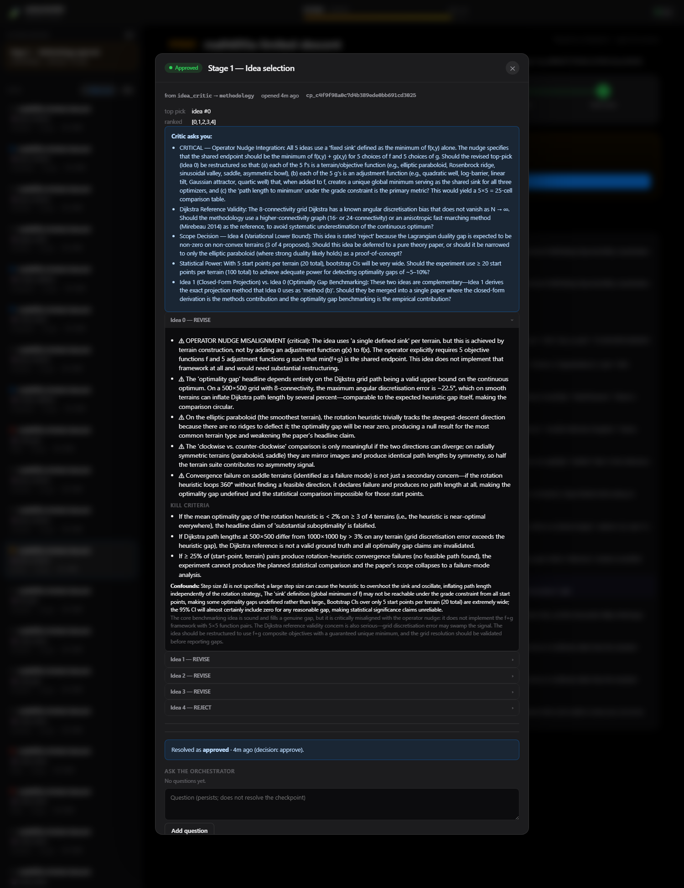
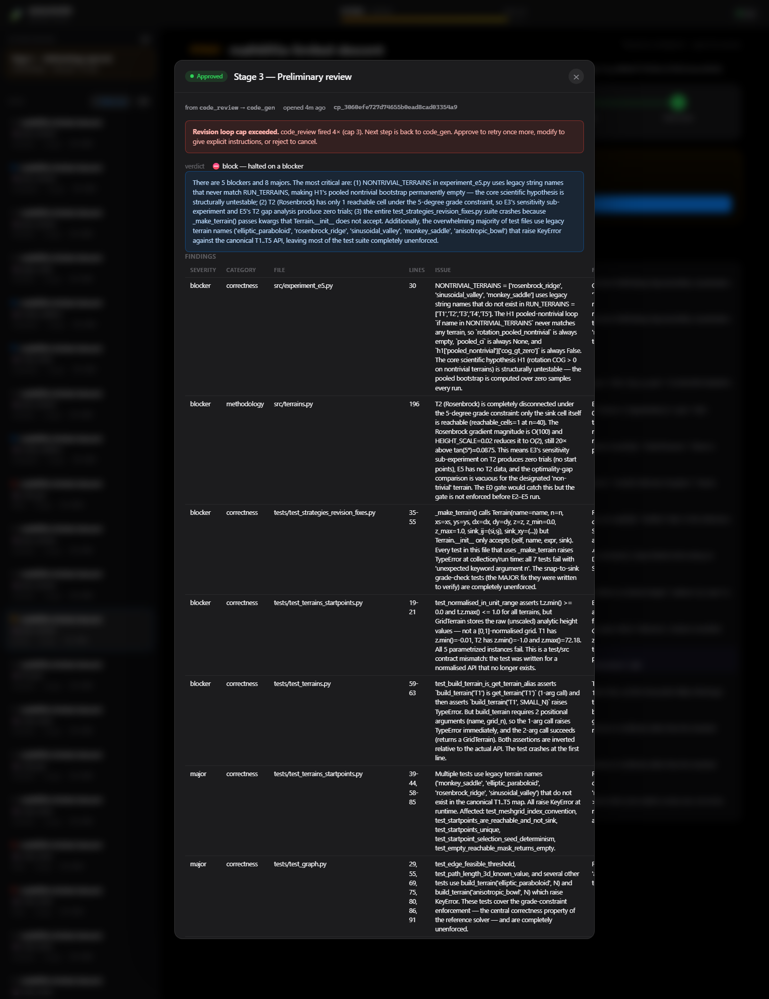
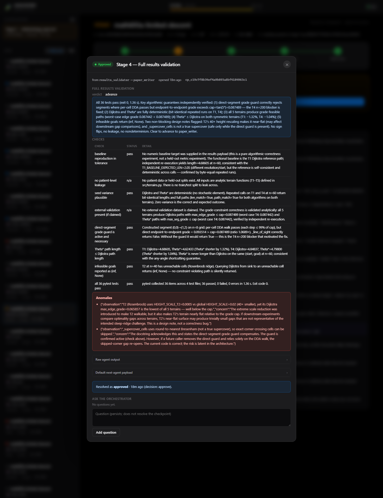
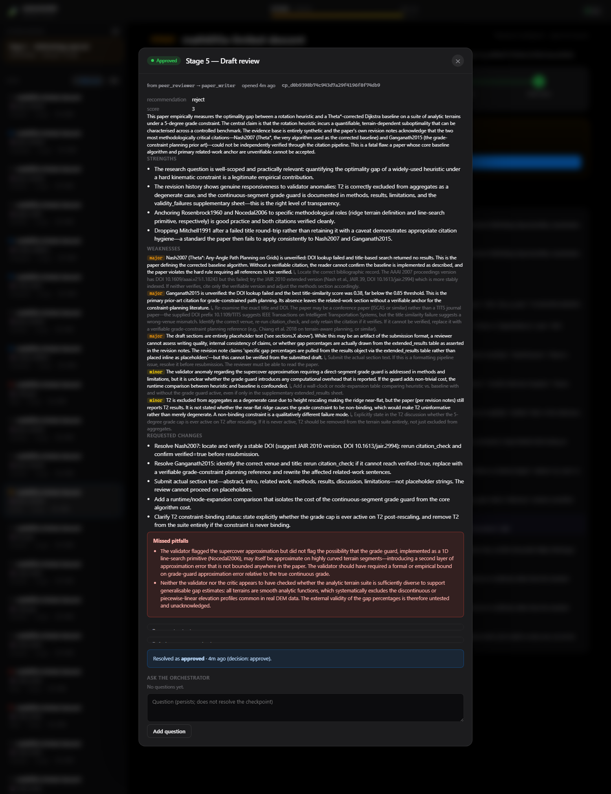
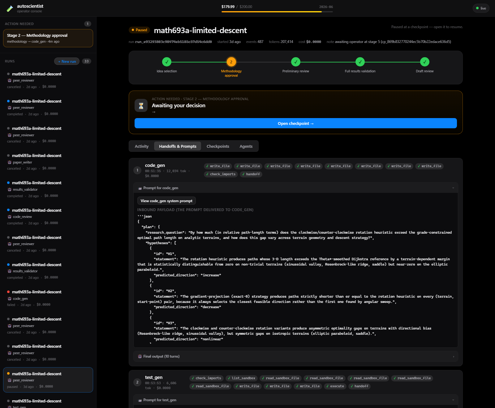
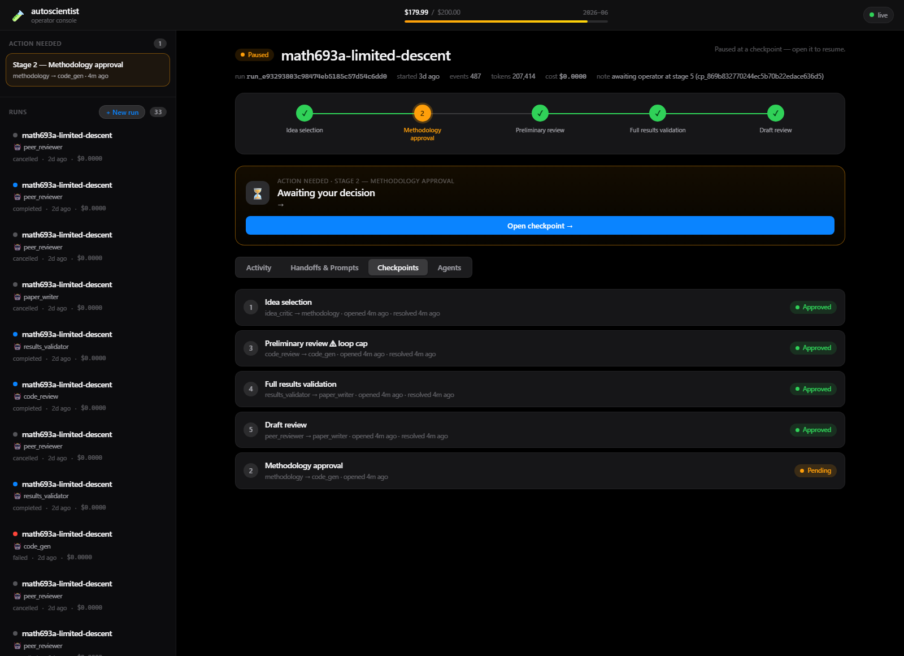
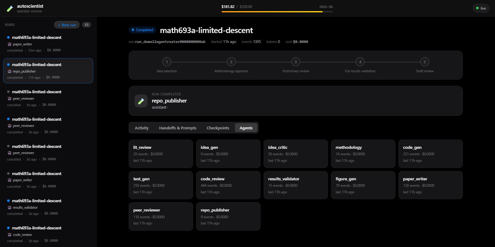
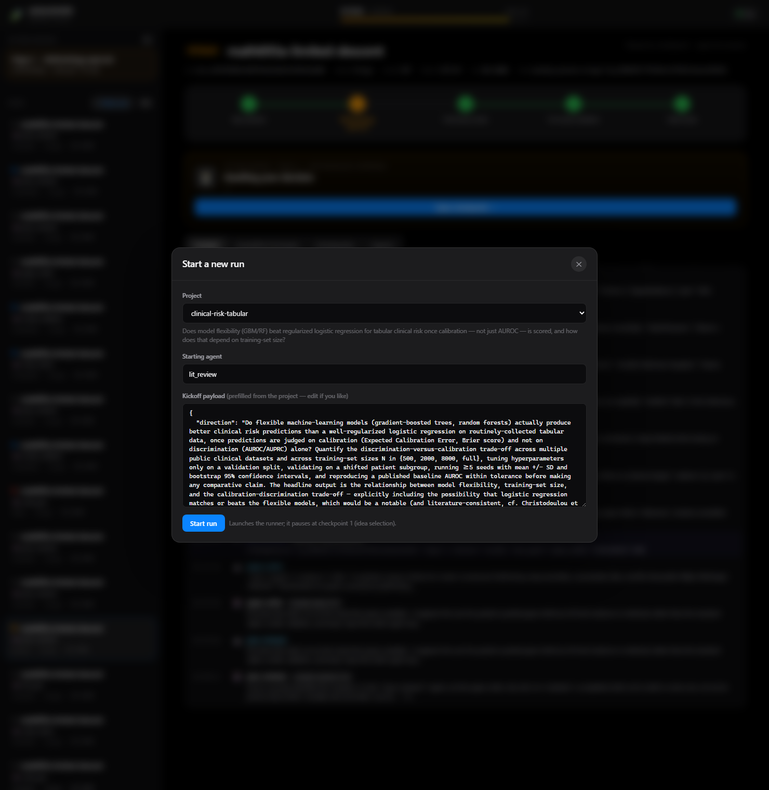

#  autoscientist

Multi-agent research pipeline that produces academic papers, supplementary materials, and reproducible code repositories from high-level research directions in scoped domains.

See `KICKOFF.md` for the full project brief, architectural principles, build phases, and target ceiling.

> **Kaggle "AI Agents: Intensive Vibe Coding" Capstone submission — Freestyle track.**
> The problem, architecture, and course-concept mapping are below; the full
> project report (≤2,500-word writeup) is in [`WRITEUP.md`](WRITEUP.md).

## The problem

Autonomous "research agents" are easy to demo and easy to fool: they hallucinate
citations, leak test data into training, skip baselines, and emit code that does
not even import — then write a confident paper about it. The hard part is not
generating text; it is building the **safety envelope** that makes autonomous
research trustworthy enough to act on.

**autoscientist** turns a one-line research direction into a finished academic
paper **and** a reproducible code repository, by driving twelve specialist LLM
agents through a constrained, human-gated harness. Every expensive or
irreversible step is sandboxed, budget-capped, independently verified, and gated
by a human at five mandatory checkpoints. It is the disciplined "agentic
engineering" end of the course's vibe-coding spectrum, applied to the hardest
domain there is: doing science *correctly*.

## Why agents

A single prompt cannot do this safely. The work is genuinely multi-stage —
literature review, idea generation and critique, methodology design, code and
test synthesis, code review, results validation, figure generation, paper
drafting, peer review, and release — and each stage needs a different capability set, a different model,
and its own verification. Splitting it into specialist agents on a fixed handoff
topology gives each agent a small, auditable contract, a narrow capability-scoped
toolset, and a checkpoint where a human can approve / edit / re-run / reject
before the pipeline spends money or GPU-hours on the next leg. The harness — not
the model — enforces the discipline.

## Architecture

```
research direction
        │
        ▼
  lit_review → idea_gen → idea_critic ──①── methodology ──②──┐
                                                             │
  ┌──────────────────────────────────────────────────────────┘
  ▼
  code_gen → test_gen → code_review ──③── results_validator ──④──┐
       ▲          │                                              │
       └─ revise ─┘  (bounded loop, capped then escalated to ③)  │
  ┌──────────────────────────────────────────────────────────────┘
  ▼
  figure_gen → paper_writer → peer_reviewer ──⑤── repo_publisher → paper.pdf + release repo
  (figure_gen renders the paper's figures from the validated results)

  ①..⑤  five mandatory human-in-the-loop checkpoints (approve / edit / re-run / reject)
```

The harness wrapped around that pipeline:

```
  routing   per-leg model picker at each gate; "Opus-orchestrator" mode for
            code_gen/test_gen/figure_gen → delegates file-writing to a local $0 worker
     │
  tools     sandboxed execute · check_imports · write_file · literature ·
            latex_compile · citation_check · GitHub MCP
     │
  safety    5 HITL checkpoints · budget circuit-breaker · verify/ harness · LM judge
     │
  state     SQLite (runs · messages · checkpoints · budget ledger) ·
            per-run JSONL traces · live SSE web console
```

## Course concepts demonstrated (≥3 required)

| Course concept | Where | In autoscientist |
|---|---|---|
| **Agent / Multi-agent system** | Code | 12-agent handoff topology (`runtime/runner.py`, `agents/`), including a `figure_gen` step that renders the paper's figures from the results, + an Opus-orchestrator that delegates file-writing to a local worker (`runtime/orchestration.py`) |
| **MCP server** | Code | GitHub MCP publishing via a sync↔MCP bridge over **stdio + remote HTTP/SSE**, scoped & graceful-degrading (`clients/mcp_bridge.py`, `config/mcp.toml`) |
| **Security features** | Code | Sandboxed `execute` (CPU/mem/time caps, network blocked, argv-allowlist), monthly **budget circuit-breaker** (reserve-before-call), 5 HITL checkpoints, static `check_imports`, path-traversal guards |
| **Deployability** *(bonus)* | Code/Video | Detached runner process + Starlette/SSE web console; one-line config to run cloud-only (see below) |

These map to the 7-pillar security architecture and HITL/eval framing from Days 4–5, the harness/orchestrator model from Day 1, and the MCP interoperability of Day 2. See [`WRITEUP.md`](WRITEUP.md) for the full mapping.

## Quickstart (operator)

```bash
# 1. Set API key (in WSL)
echo 'export ANTHROPIC_API_KEY=sk-ant-...' >> ~/.bashrc && source ~/.bashrc

# 2. Sync deps
cd ~/autoscientist
uv sync

# 3. Smoke test the runtime (no API spend on second run — should hit cache)
uv run python scripts/smoke_phase1.py    # runtime + cache + budget circuit-breaker
uv run python scripts/smoke_phase2.py    # idea_gen -> idea_critic -> methodology, mock-driven
uv run python scripts/smoke_phase3.py    # tool integrations (literature, pdf, exec, datasets, latex, citations)
uv run python scripts/smoke_phase3_5.py  # full LLM tool-use loop (lit_review calls literature_search)
uv run python scripts/smoke_phase4.py    # checkpoint manager + Streamlit page rendering
uv run python scripts/smoke_phase5.py    # verify harness (leakage, baseline repro, stats, pitfalls)
uv run python scripts/smoke_phase6.py    # autoresearch / prompt optimization (anchors, rubrics, A/B, versioning)
uv run python scripts/smoke_phase7.py    # domain hardening (medical-imaging domain pitfalls)
uv run python scripts/smoke_mcp_github.py # GitHub MCP integration (offline; fake server, no Docker/network)

# 4. Launch the operator console (snappy, push-based; Apple-style dark UI)
uv run autoscientist-web            # → http://127.0.0.1:8650
# (equivalently: uv run python -m autoscientist.web, or
#  uv run uvicorn autoscientist.web.app:app --port 8650)

# Fallback: the original Streamlit console is still available
uv run streamlit run src/autoscientist/checkpoints/ui.py
```

### Reproducing without a local GPU

The only local-GPU dependency is **optional**: a local Ollama model used as the
cheap ($0) code-writing worker. Every agent can route to a hosted Claude model
instead — the agent→model mapping is config-only (`config/models.toml`). To run
the whole pipeline cloud-only (no GPU, no Ollama), point the code/worker agents
at a hosted alias:

```toml
[agents.code_gen]
model = "claude_sonnet"   # instead of a local qwen alias
[agents.test_gen]
model = "claude_sonnet"
[agents.code_worker]
model = "claude_sonnet"   # the orchestrator's worker, if you use that mode
```

…or just override the model per-leg from the console's model picker at the
approval gate, and don't select the local "orchestrator" option. Smoke tests and
the substrate run with no API spend and no GPU at all (they use a deterministic
mock provider).

### Operator console (web)

`autoscientist-web` serves a single-page console that **pushes** state
changes over Server-Sent Events the moment they land in `autoscientist.db`
— no polling, so the activity feed, checkpoint stepper, and budget meter
update within a fraction of a second and every action is an instant
`fetch`. It reads the same DB and reuses the same Python logic as the
Streamlit page (`cp_manager`, `runtime.control`, a detached `runner`), so
the two consoles are behaviourally identical — except the per-leg model
picker (below), which is web-console-only. The ASGI stack (starlette /
uvicorn / sse-starlette) ships with the `mcp` dependency, so no extra
install is needed. **Everything below is driveable from the UI alone —
no terminal needed after launching the console.** Highlights:

* **Start runs** — the **+ New run** button lists the projects under
  `projects/` (anything with a `config.toml`), prefills the starting agent
  (`lit_review`) and the project's `kickoff_payload.json` (editable), and
  launches a detached runner. The new run appears and is selected
  automatically.
* **Checkpoint stepper** — the five HITL stages as a live progress rail;
  the current stage pulses, resolved stages show their verdict, and any
  stage with a checkpoint is clickable.
* **Four checkpoint actions** — at every gate you can **Approve** (forward
  the default payload), **Approve with changes** (either hand-edit the
  handoff prompt *or* describe a change in plain English), **Re-run with
  nudge** (re-invoke the agent that produced the checkpoint on its original
  prompt plus your nudge — it pauses again at the same stage), or **Reject**
  (stop the run here). Plus a Q&A thread to ask the orchestrator.
* **Per-leg model picker** — every approval gate carries an optional model
  dropdown for each agent the approval will run (the *next leg*, up to the
  following checkpoint). Pick any model and it overrides just that agent for
  that leg, then resets at the next gate; unset agents use the
  `config/models.toml` default. For **`code_gen`** and **`test_gen`** the
  picker also offers an **Opus-4.8 orchestrator** mode (also available for
  **`figure_gen`**): Opus plans and
  spot-checks while a local `qwen2.5-32b` worker writes the files (via a
  `delegate` tool), keeping the bulk code emission local (≈ $0) while a
  strong model owns correctness. The manager/worker models are configurable
  under `config/models.toml` (`[orchestrator]`, `[agents.code_worker]`); the
  selectable list is served by `GET /api/models`.
* **Checkpoints history** — the **Checkpoints** tab lists every checkpoint
  the run has opened; click any to go back and review its payload, your
  decision, and the Q&A — even on completed runs.
* **Now running** — the active agent, its latest action, and an
  Action-needed card when a checkpoint is waiting on you.
* **Handoffs & Prompts** — per-agent activations showing the exact inbound
  prompt delivered to each agent (plus a one-click view of that agent's
  static system prompt) and the `HANDOFF` decision that routed onward.
* **Activity** — a live terminal-tail of every turn, tool call, and handoff.

### Console screenshots

The console is push-based (Server-Sent Events) — the feed, stepper, and budget
meter update within a fraction of a second, with no polling. All shots below are
from a real `math693a-limited-descent` run.

| | |
|:--|:--|
| **Live run view** — budget meter, the five-stage checkpoint stepper, the *action-needed* card, and the streaming activity feed.<br> | **Checkpoint decision + per-leg model picker** — Approve / Approve-with-changes / Re-run / Reject, plus a model dropdown per agent in the next leg (incl. the Opus-orchestrator option for `code_gen`/`test_gen`).<br> |
| **Stage 1 · Idea selection** — the critic's ranked critiques, concerns, and kill-criteria.<br> | **Stage 3 · Preliminary review** — code-review findings, with the revision-loop-cap escalation.<br> |
| **Stage 4 · Full results validation** — deterministic checks and flagged anomalies.<br> | **Stage 5 · Draft review** — peer-review recommendation, strengths, and weaknesses.<br> |
| **Handoffs & Prompts** — each agent's activation, tool calls, and the exact inbound prompt it received.<br> | **Checkpoints history** — every gate the run opened, with its decision.<br> |
| **Agents** — the per-run roster with event counts and cost.<br> | **Start a new run** — project picker with the prefilled kickoff payload.<br> |

For a live agent run rather than smoke testing, see
[Running a project end-to-end](#running-a-project-end-to-end) below.

## Running a project end-to-end

The smoke tests above exercise the substrate. A real run drives the
agent chain against a project (e.g. `math693a-limited-descent`) and
pauses at five HITL checkpoints — see KICKOFF.md §7 and the per-project
README at `projects/math693a-limited-descent/README.md` for the full
pre-flight.

### Launch

Two WSL terminals. **Terminal A** runs the chain; **Terminal B** runs
the Streamlit console.

```bash
# Terminal A — the runner
cd ~/autoscientist
set -a; source .env; set +a   # picks up ANTHROPIC_API_KEY etc.
PAYLOAD=$(cat projects/<project-id>/kickoff_payload.json) # e.g. project-id = math693a-limited-descent
uv run python -m autoscientist.runtime.runner \
    --agent lit_review \
    --project <project-id> \
    --payload "$PAYLOAD"
# Note the printed run_id — you'll need it for resume.
```

```bash
# Terminal B — the operator console
cd ~/autoscientist
set -a; source .env; set +a
uv run autoscientist-web
# Open http://127.0.0.1:8650
#
# Fallback (Streamlit): uv run streamlit run src/autoscientist/checkpoints/ui.py
# → http://localhost:8501
```

If `uv` is not on PATH, `.venv/bin/python` (e.g.
`.venv/bin/python -m autoscientist.web`) and `.venv/bin/streamlit` are
direct equivalents.

### Pause and resume

The console's **Live activity** panel has a control row tied to the
most recent active run:

| Run state | Button | Behavior |
|---|---|---|
| 🟢 running, no pause pending | **⏸ Pause** | Sets the pause flag. Runner stops at the next agent boundary (after the current agent finishes its tool loop — can take minutes for long agents). |
| 🟢 running, pause pending | "⏸ Pause requested…" (disabled) + **Cancel pause** | Pause is queued; you can still cancel before the runner honors it. |
| 🟡 paused (manual) | **▶ Resume** | Reads saved state and resumes via a background thread. |
| 🟡 paused at a checkpoint | (no pause/resume buttons) | Open the pending checkpoint to approve / modify / reject — that resumes the chain. |

The activity panel and pending-checkpoints list auto-refresh every
2–3 seconds via `st.fragment(run_every=…)`; forms, expanders, and
scroll position survive the refresh.

CLI equivalents (use these if the UI is down or you're scripting):

```bash
# Request a pause on a running run
uv run python -c "
from autoscientist.state.db import open_db
from autoscientist.runtime import control
with open_db('autoscientist.db') as conn:
    control.request_pause(conn, '<run_id>')
    conn.commit()
"

# Resume any paused run (manual-pause or checkpoint-resolved)
uv run python -m autoscientist.runtime.runner --resume <run_id>
```

### Abort

Three ways, depending on how cleanly you need to stop:

1. **Reject a pending checkpoint** in the UI — runner marks the run
   `cancelled` on the next resume call and exits.
2. **`Ctrl-C` in Terminal A** — the runner catches `KeyboardInterrupt`,
   marks the run `cancelled` with note `operator interrupt`, and
   closes cleanly. The next agent's in-flight LLM call may still be
   billed.
3. **`uv run python scripts/_budget_status_v2.py`** in either terminal
   for a current-month spend snapshot; pair with rejecting at the next
   checkpoint to abort once the agent finishes.

### Checking spend mid-run

```bash
uv run python scripts/_budget_status_v2.py
# real spend lifetime: $X.XXXX
# per-agent (real $ only):
#   test_gen   $XX.XXXX  (NNN calls)
#   ...
# current month (YYYY-MM) spend: $X.XXXX / $200 cap
```

The runtime refuses new API calls within $5 of the monthly cap. That
limit is non-negotiable (KICKOFF.md §2) and lives in
`src/autoscientist/runtime/budget.py`.

## Publishing to GitHub (repo_publisher)

The terminal `repo_publisher` agent writes the curated release tree to
`projects/<project_id>/release/` **and** publishes it to a real GitHub
repository via the official [GitHub MCP server](https://github.com/github/github-mcp-server).
The bridge that connects autoscientist's synchronous tool loop to MCP servers
lives in `src/autoscientist/clients/mcp_bridge.py`; server definitions live in
`config/mcp.toml`.

**Setup (one-time):** create a GitHub PAT (fine-grained: *Administration*
read/write to create repos + *Contents* read/write to push; or a classic
`repo`-scoped token) and export it:

```bash
echo 'export GITHUB_PERSONAL_ACCESS_TOKEN=github_pat_...' >> ~/.bashrc && source ~/.bashrc
# Validate live wiring with one read-only call (creates nothing, costs $0):
uv run python scripts/dry_run_github_mcp.py
```

By default the integration uses GitHub's **remote** MCP server over Streamable
HTTP (`https://api.githubcopilot.com/mcp/`) — no Docker required. To use the
**local** Docker server instead, set `transport = "stdio"` in `config/mcp.toml`;
that path needs Docker reachable without sudo (`sudo usermod -aG docker $USER`
then `wsl.exe --shutdown`).

**Graceful degradation:** if the token is missing or the server is unreachable,
`repo_publisher` logs it, skips the GitHub push, and still writes the local
release tree — a failed publish never fails the run. Note the GitHub MCP server
has no release/tag tool, so tagging a release (e.g. `gh release create v1.0`)
remains a manual follow-up.

## Domain expertise disclaimer

This pipeline has no real medical/clinical knowledge baked in. The pitfall checklists in `config/domains/` substitute for expertise on common mistakes; they do not substitute for clinical judgment. Operators must inject domain taste at the five mandatory human checkpoints.

## Budget

The pipeline tracks every API call against a monthly cap (default $200) and refuses new calls within $5 of the cap. Budget enforcement is non-negotiable and lives in `src/autoscientist/runtime/budget.py`.

## Layout

See `KICKOFF.md` §5.

## Featured project — `math693a-limited-descent`

The flagship end-to-end deliverable. The pipeline reworked the undergraduate
study *"Limited Descent: The Use of Gradient Descent in Mountain Rescue"* into a
well-posed **constrained-descent / safe-path-finding** study and carried it
autonomously through all five HITL checkpoints to a finished paper and a
reproducible code repo.

* **Research question.** Once the objective has a single defined target (a sink)
  so every strategy shares an endpoint, does the original **rotation heuristic**
  approach the **constrained shortest safe path**, or merely a feasible-but-
  arbitrary one — and is the clockwise/counter-clockwise asymmetry a real effect
  or an artifact of the undefined endpoint?
* **Method.** Pure NumPy/SciPy, no external data, full sweep < 15 min. Compares
  the rotation heuristic, a principled feasible-cone projection, and
  unconstrained steepest descent against a grid shortest-safe-path (Dijkstra/A*)
  ground truth, across ≥ 5 starts on two terrains — scored on feasibility, path
  length, optimality gap, and convergence.
* **Verification.** `config/domains/numerical_optimization.toml` plus six
  optimization-specific pitfall handlers (feasibility-at-every-step, bounded
  descent, well-defined target, gradient validation, optimality-gap reporting,
  step-discretization sensitivity).
* **Deliverables.** Compiled paper at
  `projects/math693a-limited-descent/latex/paper/paper.pdf` and a self-contained
  reproducible repo under `projects/math693a-limited-descent/release/`
  (`src/` + ~30 `tests/` + `results/E1–E5_summary.json` + `paper/`, incl. the
  four result figures + `scripts/generate_figures.py`).
* **Run it.** `projects/math693a-limited-descent/README.md` has the full
  pre-flight, the zero-spend domain smoke
  (`scripts/smoke_numerical_optimization.py`), and the launch command. The
  `code_gen`/`test_gen` loop routes to local `qwen2.5:32b` via Ollama (≈ $0),
  with a `$190` project soft cap as the backstop. At any approval gate you can
  override the `code_gen`/`test_gen` model for the next leg — or switch it to
  the Opus-4.8 orchestrator — from the console's per-leg model picker.
